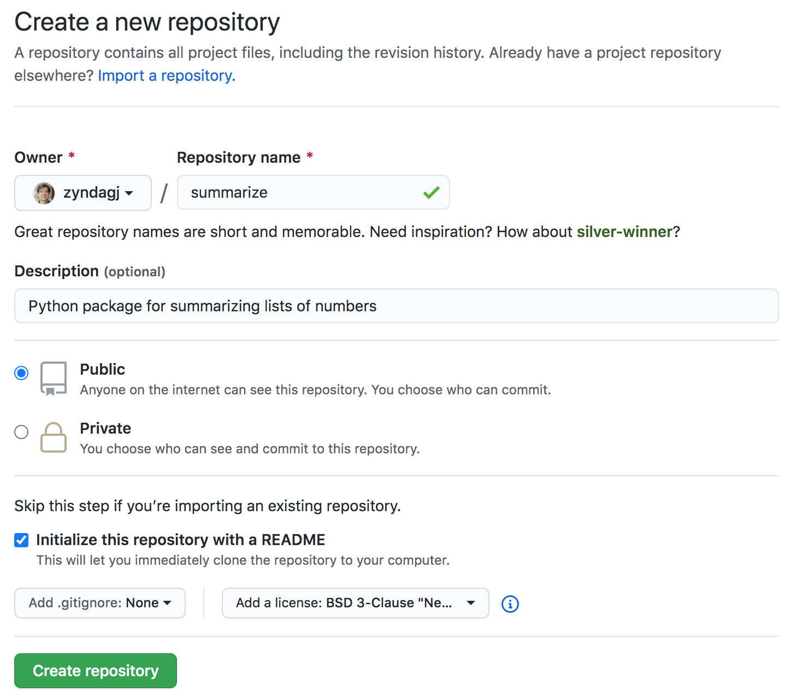
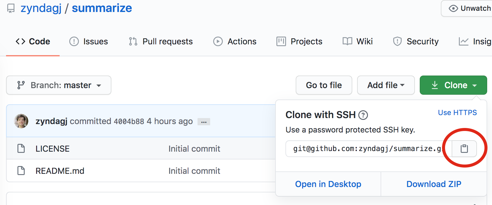

Creating the package repository
===============================

The python package we create in this tutorial will be hosted from GitHub.

   *We won't be targeting pypi with this tutorial because it is a proper archive, where projects are not meant to be deleted*

While this means your source code will be public, you should always expect the source code of your python packages and scripts to be visible since it is only compiled at runtime.

Create the repository
---------------------

Log in to `GitHub
<https://www.github.com>`_ and create a new repository.
The package we create in this tutorial will generate and summarize a list of numbers, so we'll call both the project and package "summarize."

Make sure you initialize the repository with a README file, and choose an appropriate license.

Then click **"Create repository"** to create your repository.

Clone the repository locally
----------------------------

Click the "clone" button to get the URL to clone your repository locally.

The URL that was copied can then be used to "git clone".
After cloning the repository, enter the directory.

::

   $ git clone <paste>
   $ cd summarize
