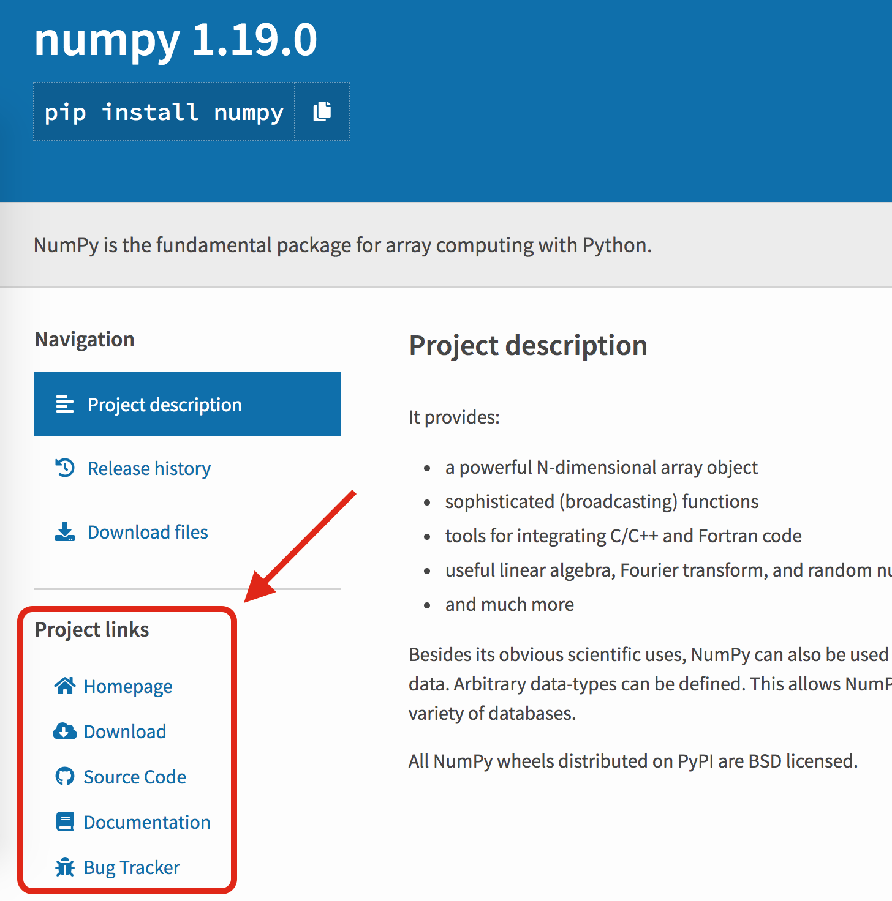

Creating the package files
==========================

At this point, the package directory is complete.
However, the metadata that describes the package is still missing.

This means you can

::

   $ python
   >>> import summarize
   >>> summarize.main()
   35.0

but ``pip install .`` will not work yet.
To enable this, the `setup.py <https://packaging.python.org/tutorials/packaging-projects/#creating-setup-py>`_ file needs to be created to describe the package and any requirements.

The ``setup.py`` file
---------------------

Open your favorite text editor and create your ``setup.py`` containing the following fields:

.. literalinclude:: assets/setup.py
   :language: python
   :linenos:
   :emphasize-lines: 9

While the ``url`` field on line 9 is optional for publishing, fill in the URL to your GitHub repository to get used to providing this information.
If you eventually publish a package on pypi, this is how the project links are populated.

There are many other optional fields to describe the package, which you can see `here <https://packaging.python.org/guides/distributing-packages-using-setuptools/#setup-args>`_.
Feel free to take some time to add any additional fields.

One of the main reasons to transition from a simple script to a full package is to not only support an intuitive installation process, but to also specify fine-grained dependencies.

`python_requires <https://packaging.python.org/guides/dropping-older-python-versions/#specify-the-version-ranges-for-supported-python-distributions>`_
   This field on line 11 restricts the version of python that can install the summarize package.
   In this case, Python must be at least version 3.6, and we do not assume summarize will work with the hypothetical Python 4.

`install_requires <https://packaging.python.org/discussions/install-requires-vs-requirements/#install-requires>`_
   This field on line 12 is a list of packages and potentially versions required for the package to run.
   We know that summarize imports and uses Numpy for generating and summarizing random numbers. The `current version <https://github.com/numpy/numpy/releases>`_ of Numpy is 1.19.
   Instead of just saying "this requires numpy", the version was restricted to a release between 1.0 and 2.0.
   While your software may not install when Numpy eventually transitions to v2, it would force you to determine whether it was still compatible, which is usually done through testing.

The ``extra_requires`` is not a required field, but the next two sections in this tutorial will depend on both ``pytest`` and ``tox``, so they were included now to streamline their usage later.

Installing your package
-----------------------

At this point, you should be able to install your package with ``pip``. Installing summarize with

::

   $ pip install --user .
   $ pip list | grep summarize

installs it, where ``.`` targets the package in your current working directory (cwd), as a static package to your local site-packages.
You can also enable active development by installing it with

::

   $ pip uninstall -y summarize
   $ pip install --user -e .
   $ pip list | grep summarize
   summarize                     0.0.1               /Users/gzynda/Documents/reproducible_python/docs/assets

If the installation location is already on your path, you'll be able to run the ``summarize`` CLI script created by ``setup.py``.

::

   $ summarize -h
   usage: summarize [-h] [-N INT]

   A simple tool for computing the mean of a random list

   optional arguments:
     -h, --help  show this help message and exit
     -N INT      Number of random integers [5]

If this does not work, you'll have to add the install location to your path

::

   # Linux + macOS
   export PATH=~/.local/bin:${PATH}
   # Windows
   # ????

Current structure
-----------------

::

   $ tree
   .
   ├── setup.py
   └── summarize
       └── __init__.py

Note: You may see additional files in this tree if you did run ``__init__.py`` or ``import summarize``.

Additional Information
----------------------

* https://packaging.python.org/guides/distributing-packages-using-setuptools/
* https://github.com/pypa/sampleproject
